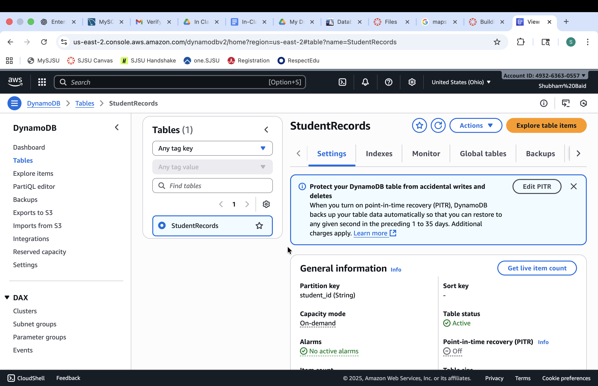
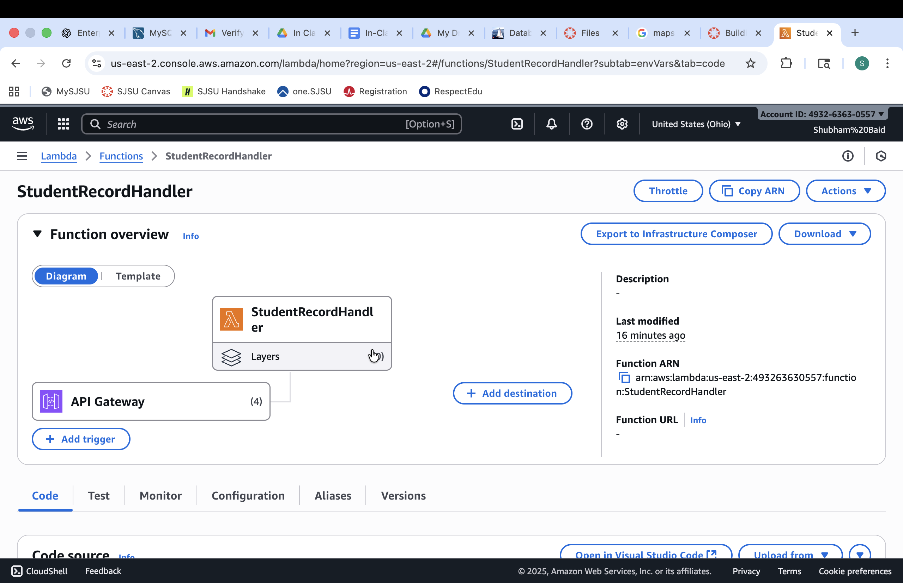
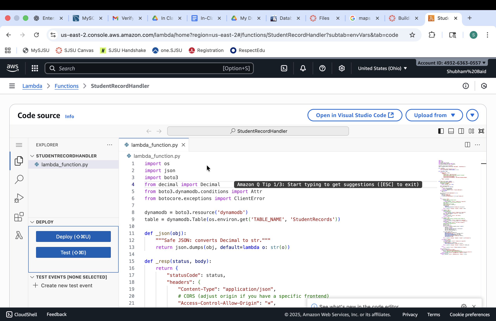
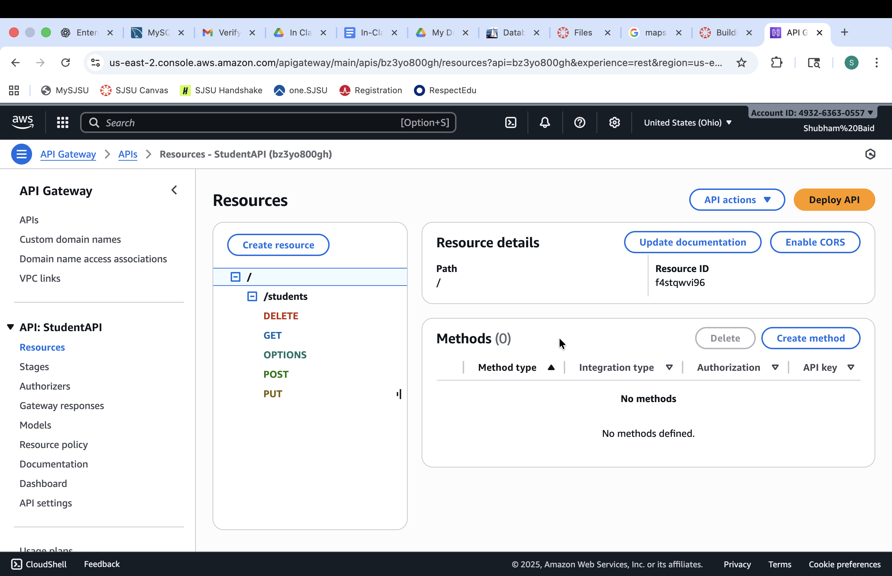
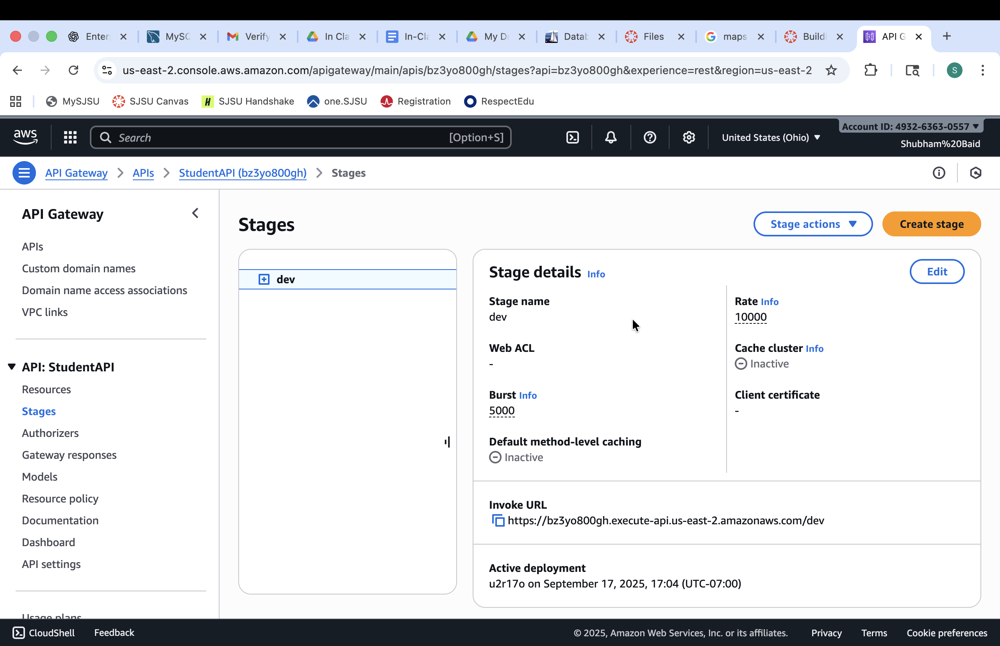
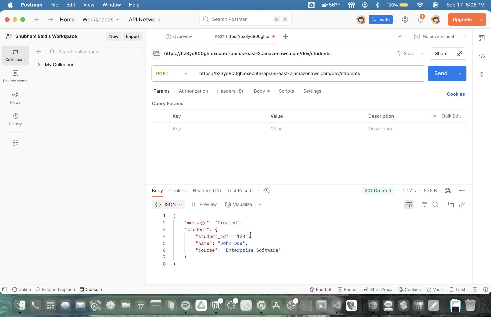
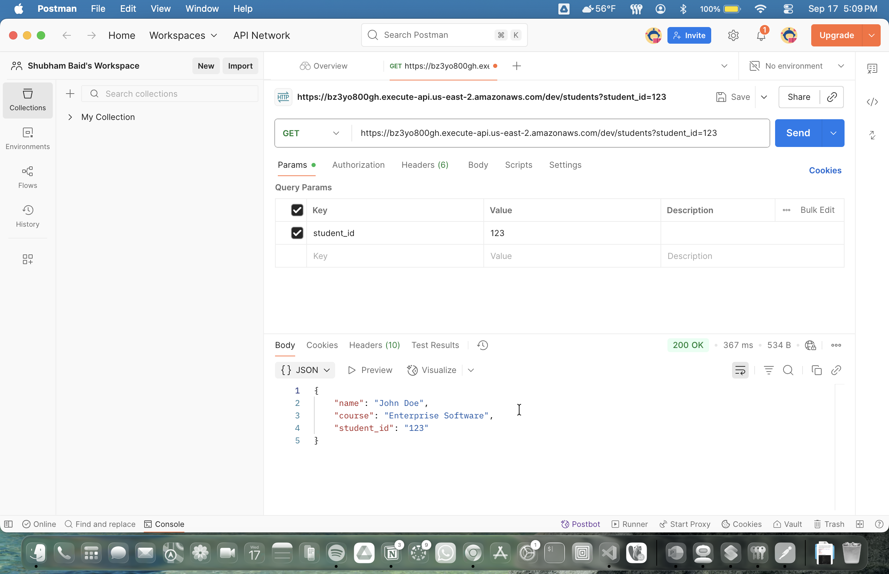
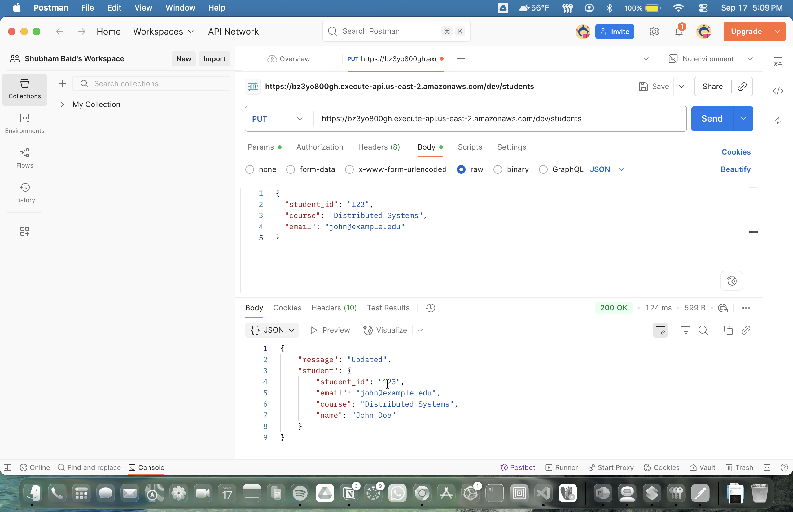
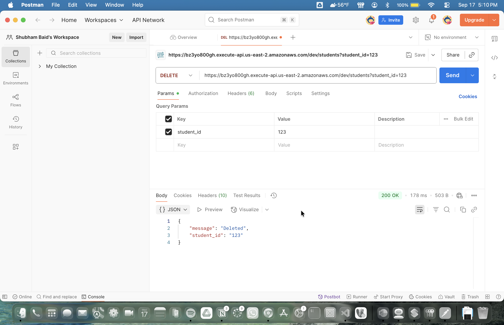

# 🚀 Serverless Web Application with DynamoDB and AWS Lambda

This project demonstrates a simple **serverless CRUD web application** built using:

- **DynamoDB** for database storage  
- **AWS Lambda** for serverless compute  
- **API Gateway** for exposing REST APIs  

---

## 📌 DynamoDB Table Creation

---

## ⚡ Lambda Function Creation & Code Deployment

---

## 🌐 API Gateway: API Creation & Deployment

---

## 🛠️ CRUD Operations via Postman

- **Create / Insert Item**  
  

- **Read / Get Item**  
  

- **Update Item**  
  

- **Delete Item**  
  

---

## 💡 Reflection

I didn’t find the assignment itself particularly difficult; the bigger gaps were items not covered in the rubric—such as creating the IAM role and permissions, deploying code to Lambda, and wiring up API Gateway (methods, stages, and CORS). Those missing steps led me to use ChatGPT for the precise sequence. Once those were clear, the core tasks—creating the DynamoDB table, writing the Lambda function, and exposing it through API Gateway—were straightforward.

What I liked about the serverless approach is how much busywork it cuts out. I didn’t have to spin up servers, patch anything, set up Nginx, worry about capacity, or fuss with system packages. I just wrote the function and hit ‘Deploy’. This assignment gave me hands-on time with three core services (DynamoDB, Lambda, API Gateway) and made the AWS console feel a lot less mysterious. Having a clear, end-to-end path to follow was the difference between poking around aimlessly and getting something working quickly.
